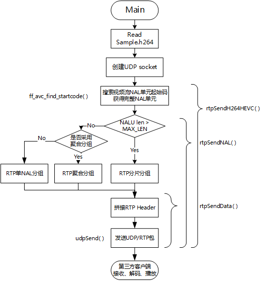

## Note

this library is a Modifcation of the Orginal one taht just support H264

# RTP

Implementation of a RTP server that sends video stream (H.264/HEVC) using the Real-time Transport Protocol(RTP) based on Linux/MacOS.

一个基于 Linux/MacOS 平台的可以发送携带 H.264/HEVC 媒体类型的 RTP 视频流的示例程序。

## RTP-Server

这个示例程序是参考 ffmpeg 的代码，实现了读取一个 Sample.h264 裸流文件，（打算以后支持 HEVC/H.265 所以文件名有 HEVC），通过 ffmpeg 内置的函数查找 NAL 单元起始码，从而获取一个完整的 NALU。根据 NALU 长度选择 RTP 打包类型，然后再组装 RTP 头部信息，最终发送到指定 IP 和端口，本例发送到本机 1234 端口。



### Receive & Play Video as RTP Client

**1 .FFmpeg/ffplay**

play rtp video stream.

```sh
ffplay -protocol_whitelist "file,rtp,udp" play.sdp
```

send video file as RTP server

```sh
ffmpeg -re -i Sample.h264 -vcodec copy -f rtp rtp://127.0.0.1:1234 > play.sdp
```

**2. VLC**

Open **play.sdp** using VLC before RTPServer runs.

## RTP 封装 H.264 码流规范

本文简单说明 RTP 结构和实现，详细说明请参考标准文档[RTF6184: RTP Payload Format for H.264 Video](https://tools.ietf.org/html/rfc6184)。

### RTP Header

```
     0                   1                   2                   3
     0 1 2 3 4 5 6 7 8 9 0 1 2 3 4 5 6 7 8 9 0 1 2 3 4 5 6 7 8 9 0 1
    +-+-+-+-+-+-+-+-+-+-+-+-+-+-+-+-+-+-+-+-+-+-+-+-+-+-+-+-+-+-+-+-+
    |V=2|P|X|  CC   |M|     PT      |       sequence number         |
    +-+-+-+-+-+-+-+-+-+-+-+-+-+-+-+-+-+-+-+-+-+-+-+-+-+-+-+-+-+-+-+-+
    |                           timestamp                           |
    +-+-+-+-+-+-+-+-+-+-+-+-+-+-+-+-+-+-+-+-+-+-+-+-+-+-+-+-+-+-+-+-+
    |           synchronization source (SSRC) identifier            |
    +=+=+=+=+=+=+=+=+=+=+=+=+=+=+=+=+=+=+=+=+=+=+=+=+=+=+=+=+=+=+=+=+
    |            contributing source (CSRC) identifiers             |
    :                             ....                              :
    +-+-+-+-+-+-+-+-+-+-+-+-+-+-+-+-+-+-+-+-+-+-+-+-+-+-+-+-+-+-+-+-+
```

- V(version): 当前版本设为 2。
- P(padding): 载荷之后填充数据，用于要求固定长度 RTP 包场景，一般不用，设置为 0。
- X(extension): 固定头部后面加头部扩展字段标志，一般不用，设为 0。
- CC(CSRC count): CSRC 字段长度
- M(marker): AU 最后一个包标志位
- PT(payload): RTP 载荷媒体数据类型，H264=96
- Sequence number: RTP 包序列号，递增 1。
- timestamp: 媒体采样时间戳，H264/HEVC 统一采用 90kHz 采样时钟，如果使用帧率 fps 来设置时间戳，则递增数值为 90000/fps。
- SSRC: 数据包同源标志，来自同一处的 RTP 包应采用固定统一数值。
- CSRC: 一般 CC=0，不用此位。

### RTP Payload

RTP Packet = RTP Header + RTP payload.

RTP Payload 结构一般分为 3 种：

1. 单 NALU 分组(Single NAL Unit Packet): 一个分组只包含一个 NALU。
2. 聚合分组(Aggregation Packet): 一个分组包含多个 NALU。
3. 分片分组(Fragmentation Unit)：一个比较长的 NALU 分在多个 RTP 包中。

各种 RTP 分组在 RTP Header 后面都跟着 `F|NRI|Type` 结构的 NALU Header 来判定分组类型。不同分组类型此字段名字可能不同，H264/HEVC 原始视频流 NALU 也包含此结构的头部字段。

```
    +---------------+
    |0|1|2|3|4|5|6|7|
    +-+-+-+-+-+-+-+-+
    |F|NRI|  Type   |
    +---------------+
```

- F(forbidden_zero_bit)：错误位或语法冲突标志，一般设为 0。
- NRI(nal_ref_idc): 与 H264 编码规范相同，此处可以直接使用原始码流 NRI 值。
- Type：RTP 载荷类型，1-23：H264 编码规定的数据类型，单 NALU 分组直接使用此值，24-27:聚合分组类型(聚合分组一般使用 24 STAP-A)，28-29 分片分组类型（分片分组一般使用 28FU-A），30-31，0 保留。

| NAL Unit Type | Packet Type | Packet Type Name               |
| ------------- | ----------- | ------------------------------ |
| 0             | reserved    | -                              |
| 1-23          | NAL unit    | Single NAL unit packet         |
| 24            | STAP-A      | Single-time aggregation packet |
| 25            | STAP-B      | Single-time aggregation packet |
| 26            | MTAP16      | Multi-time aggregation packet  |
| 27            | MTAP24      | Multi-time aggregation packet  |
| 28            | FU-A        | Fragmentation unit             |
| 29            | FU-B        | Fragmentation unit             |
| 30-31         | reserved    | -                              |

#### 单 NALU 分组

此结构的 NALU Header 结构可以直接使用原始码流 NALU Header，所以单 NALU 分组 Type = 1~23。
封装 RTP 包的时候可以直接把 查询到的 NALU 去掉起始码后的部分 当作单 NALU 分组的 RTP 包 Payload 部分。

```
     0                   1                   2                   3
     0 1 2 3 4 5 6 7 8 9 0 1 2 3 4 5 6 7 8 9 0 1 2 3 4 5 6 7 8 9 0 1
    +-+-+-+-+-+-+-+-+-+-+-+-+-+-+-+-+-+-+-+-+-+-+-+-+-+-+-+-+-+-+-+-+
    |                          RTP Header                           |
    :                                                               :
    +-+-+-+-+-+-+-+-+-+-+-+-+-+-+-+-+-+-+-+-+-+-+-+-+-+-+-+-+-+-+-+-+
    |F|NRI|  Type   |                                               |
    +-+-+-+-+-+-+-+-+                                               |
    |                                                               |
    |               Bytes 2..n of a single NAL unit                 |
    |                                                               |
    |                               +-+-+-+-+-+-+-+-+-+-+-+-+-+-+-+-+
    |                               :...OPTIONAL RTP padding        |
    +-+-+-+-+-+-+-+-+-+-+-+-+-+-+-+-+-+-+-+-+-+-+-+-+-+-+-+-+-+-+-+-+

```

#### 聚合分组

通常采用 STAP-A (Type=24)结构封装 RTP 聚合分组，下图为包含 2 个 NALU 的采用 STAP-A 结构的聚合分组。

```
     0                   1                   2                   3
     0 1 2 3 4 5 6 7 8 9 0 1 2 3 4 5 6 7 8 9 0 1 2 3 4 5 6 7 8 9 0 1
    +-+-+-+-+-+-+-+-+-+-+-+-+-+-+-+-+-+-+-+-+-+-+-+-+-+-+-+-+-+-+-+-+
    |                            RTP Header                         |
    :                                                               :
    +-+-+-+-+-+-+-+-+-+-+-+-+-+-+-+-+-+-+-+-+-+-+-+-+-+-+-+-+-+-+-+-+
    |STAP-A NAL HDR |         NALU 1 Size           | NALU 1 HDR    |
    +-+-+-+-+-+-+-+-+-+-+-+-+-+-+-+-+-+-+-+-+-+-+-+-+-+-+-+-+-+-+-+-+
    |                         NALU 1 Data                           |
    :                                                               :
    +               +-+-+-+-+-+-+-+-+-+-+-+-+-+-+-+-+-+-+-+-+-+-+-+-+
    |               | NALU 2 Size                   | NALU 2 HDR    |
    +-+-+-+-+-+-+-+-+-+-+-+-+-+-+-+-+-+-+-+-+-+-+-+-+-+-+-+-+-+-+-+-+
    |                         NALU 2 Data                           |
    :                                                               :
    |                               +-+-+-+-+-+-+-+-+-+-+-+-+-+-+-+-+
    |                               :...OPTIONAL RTP padding        |
    +-+-+-+-+-+-+-+-+-+-+-+-+-+-+-+-+-+-+-+-+-+-+-+-+-+-+-+-+-+-+-+-+
```

- STAP-A NAL HDR: 也是一个 NALU Header (**F**|**NRI**|**Type**)结构，1 字节。比如可能值为 0x18=00011000b，Type=11000b=24，即为 STAP-A。所有聚合 NALU 的 F 只要有一个为 1 则设为 1，NRI 取所有 NALU 的 NRI 最大值。
- NALU Size: 表示此原始码流 NALU 长度，2 字节。
- NALU HDR + NALU Date: 即为原始码流一个完整 NALU。

#### 分片分组

通常采用无 DON 字段的 FU-A 结构封装 RTP 分片分组。各种 RTP 分组在 RTP Header 后面都跟着 `F|NRI|Type` 结构，来判定分组类型。

```
     0                   1                   2                   3
     0 1 2 3 4 5 6 7 8 9 0 1 2 3 4 5 6 7 8 9 0 1 2 3 4 5 6 7 8 9 0 1
    +-+-+-+-+-+-+-+-+-+-+-+-+-+-+-+-+-+-+-+-+-+-+-+-+-+-+-+-+-+-+-+-+
    |                            RTP Header                         |
    :                                                               :
    +-+-+-+-+-+-+-+-+-+-+-+-+-+-+-+-+-+-+-+-+-+-+-+-+-+-+-+-+-+-+-+-+
    | FU indicator  |   FU header   |                               |
    +-+-+-+-+-+-+-+-+-+-+-+-+-+-+-+-+                               |
    |                                                               |
    |                         FU payload                            |
    |                                                               |
    |                               +-+-+-+-+-+-+-+-+-+-+-+-+-+-+-+-+
    |                               :...OPTIONAL RTP padding        |
    +-+-+-+-+-+-+-+-+-+-+-+-+-+-+-+-+-+-+-+-+-+-+-+-+-+-+-+-+-+-+-+-+
```

##### FU indicator

采用 FU-A 分组类型的话 Type = 28，NRI 与此 NALU 中 NRI 字段相同。

```
    +---------------+
    |0|1|2|3|4|5|6|7|
    +-+-+-+-+-+-+-+-+
    |F|NRI|  Type   |
    +---------------+
```

##### FU header

```
    +---------------+
    |0|1|2|3|4|5|6|7|
    +-+-+-+-+-+-+-+-+
    |S|E|R|  Type   |
    +---------------+
```

此结构中 Type 采用原始码流 NALU 中的 Type 字段，S=1 表示这个 RTP 包为分片分组第一个分片，E=1 表示为分片分组最后一个分片。除了首尾分片，中间的分片 S&E 都设为 0。R 为保留位，设为 0。

本文发表在 CSDN [RTP 协议介绍以及 C 语言实现具有发送 H.264 视频功能的 RTP 服务器](https://blog.csdn.net/shaosunrise/article/details/80374523)。
